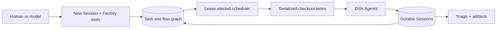

<div align="center">

# 🏭 dsh-factory

**Durable task graphs and recurring Agent work for [DeepSeek Harness](https://github.com/deepseek-ai/deepseek-harness)**

_From one prompt to a dependency-aware production line — with isolated checkouts, live Sessions, and reviewable results._

[](https://github.com/monotykamary/dsh-factory/actions/workflows/check.yml)
[](https://www.npmjs.com/package/dsh-factory)
[](https://github.com/deepseek-ai/deepseek-harness)
[](https://www.typescriptlang.org/)
[](LICENSE)

</div>

---

**dsh-factory** turns the ordinary DSH Session workflow into a durable local task factory. People can capture work from New Session, models can build dependency graphs directly, and a lease-elected scheduler runs eligible nodes through native DSH Agents without introducing a second Agent loop, tool registry, or conversation store.

## Why Factory?

| | Capability | What it unlocks |
| :-: | --- | --- |
| 🕸️ | **Dependency graphs** | Parallel branches, sequential chains, joins, and always-run finalizers in one named flow. |
| 🏃 | **Native Agent runs** | Every assignment executes as an ordinary durable DSH Session with the selected model and preset. |
| 🛤️ | **Safe checkout lanes** | Current, isolated, and predecessor-reuse lanes over managed Git worktrees with dirty-work and live-Session protection. |
| ⏰ | **One-shot + recurring schedules** | Delayed starts and Croner-backed recurrence with lease-safe activation and non-overlapping occurrences. |
| 🔁 | **Automatic failure retries** | Abruptly failed runs requeue with exponential backoff — three retries starting at thirty seconds by default — with workspace and per-task opt-outs. |
| 🏷️ | **Project-scoped identifiers** | Every workspace derives its own uppercase key with an independent counter — DOCS-3 beside SR-2 — so cross-project dependencies stay mistake-proof while legacy FAC numbers keep resolving. |
| 💬 | **First-class discussion** | Posted prompts, steer messages, reorderable queued follow-ups, images, and Factory notes in one chronological feed. |
| 🔎 | **Triage and artifacts** | Unread and failed run results, mutation receipts, plus images and videos discovered under each run's `.artifacts/` directory. |
| ✨ | **White-glove intake** | A compact Task/Flow selector extends New Session instead of duplicating its Workspace, model, permission, attachment, and draft controls. |

## How it fits



Factory is a control plane over DSH, not a replacement for it. Factory SQLite owns projects, tasks, flows, schedules, runs, and review state. DSH remains authoritative for Agent execution, model-visible messages, pending prompt order, tools, attachments, Sessions, and worktree safety.

## The workflow

1. **Capture** — send normally to create a live Session, choose **Run later** for a draft task, or place the prompt into a new or existing flow.
2. **Compose** — add searchable dependencies, parallel branches, joins, finalizers, labels, priorities, schedules, and model overrides.
3. **Run** — the scheduler claims ready work, resolves a safe checkout lane, starts a DSH Agent, and logs the assignment with dependency and mutation-ledger context.
4. **Collaborate** — Queue and Steer post through the Agent inbox; pending rows stay editable and reorderable until claimed.
5. **Finish** — a missing report receives one logged next-step reminder; `factory_finish` is followed by one concise user-facing result and settles only after the Session log is flushed.
6. **Review** — Triage preserves each terminal occurrence, including recurring runs, receipts, summaries, failures, and `.artifacts/` media.

## Packages

| Package | Responsibility |
| --- | --- |
| [`dsh-factory-protocol`](packages/protocol) | Host-independent task, flow, run, schedule, observation, and graph records. |
| [`dsh-factory-store`](packages/store) | Persistence Service Definition. |
| [`dsh-factory-store-sqlite`](packages/store-sqlite) | Transactional documents, presence, revisions, and scheduler leases. |
| [`dsh-factory-domain`](packages/domain) | State transitions, metadata settlement, artifacts, and Typert Remote methods. |
| [`dsh-factory-tools`](packages/tools) | Model graph tools, explicit completion, and the bundled Factory skill. |
| [`dsh-factory-scheduler`](packages/scheduler) | Dependency, lane, cron, cleanup, and DSH Agent reconciliation. |
| [`dsh-factory-client-ui`](packages/client-ui) | Work, task detail, Triage, New Session intake, and project settings. |
| [`dsh-factory`](.) | Installable Cordis patch-layer bundle. |

## Install

### Monotykamary DSH flavor

Factory ships in the custom Web profile beside Fabric and Fovea:

```bash
npm install --global @monotykamary/dsh@latest
dsh --profile web
```

### Add to another compatible profile

```bash
dsh plugin --profile web add dsh-factory@latest
```

Restart the selected profile after installation. Factory appears as an additive Sidebar application and stores its SQLite database under the DSH home.

<details>
<summary><strong>Install this checkout locally</strong></summary>

```bash
git clone https://github.com/monotykamary/dsh-factory.git
cd dsh-factory
pnpm install
pnpm run check
pnpm run install:local -- --profile web --skip-build
```

The installer links all eight workspace packages, validates the composed Factory rows, and never starts or restarts DSH.

</details>

## Safety model

A checkout is one serialized writer lane. Factory never force-removes a worktree, never deletes dirty work, and never releases a lane while shared presence reports a live Session. It refuses primary and unmanaged checkout removal. Publishing remains an explicit task, and cleanup cannot rewrite a flow outcome.

Recurring tasks return to **Scheduled** after every occurrence and retain each success or failure in Triage. Scheduler takeover recovers only scheduler-owned dispatches, so observation of an external Session cannot create a duplicate run.

## Browser experience

Work shows Emerging work first and then graph-ordered flows. Task detail combines properties, dependencies, schedule, model selection, run output, discussion, mutation receipts, and review media. Linked Sessions can be settled or archived; cancelled tasks that never acquired a Session can be permanently deleted after explicit acknowledgement. Relationship rails move from neutral pending nodes to a blue running spinner, green completion check, or red abrupt-failure cross.

Pasted images reuse the DSH attachment gallery and fullscreen lightbox. Task detail and exact-run Triage discover images and videos in the owning checkout's `.artifacts/` directory and open one keyboard-accessible carousel without copying media into Factory state.

## Development

Requirements: Node.js `^22.19.0 || >=24` and pnpm 11.

```bash
pnpm install
pnpm run check
```

Browser-facing changes additionally run `pnpm run test:e2e` against an assembled Factory Web profile. Local captures belong under `.artifacts/screenshots/` and are excluded from Git and npm.

See [`docs/architecture.md`](docs/architecture.md) for durable authority, intake, metadata, scheduling, execution, Triage, cleanup, and browser-state ownership.
